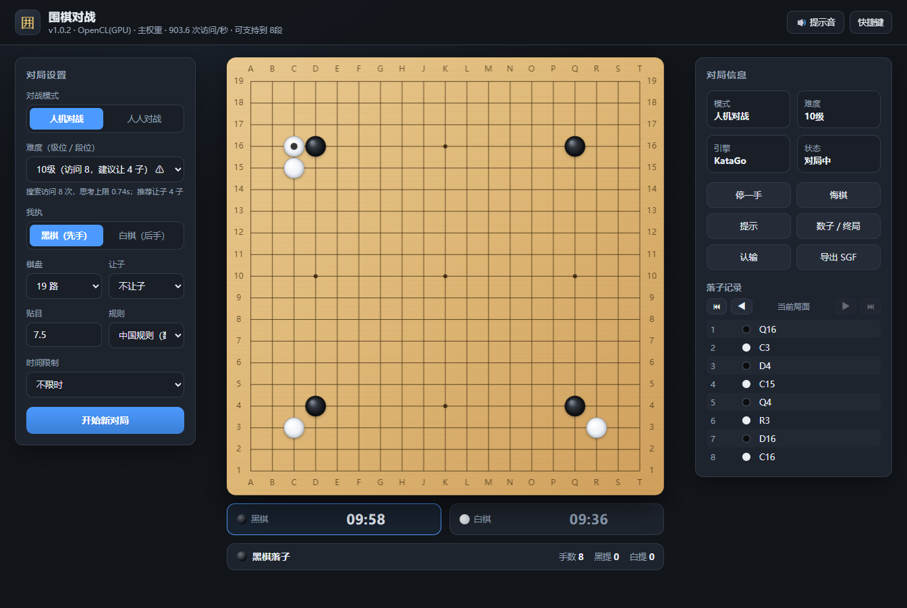

# 围棋对战程序

一个用 KataGo 做棋力内核的围棋程序，桌面版。能跟电脑下，也能两个人对着同一台机器下。
电脑一方分了 33 档，从 25 级排到业余 8 段；低段位会让子，走法也更像人下出来的，
不会十几级就开始算得比你深二十手。

程序不需要联网——引擎和模型都在本地。因为最后要装到实体电驱棋盘上，
驱动电机的接口也提前留了出来，协议单独写在 [docs/hardware-protocol.md](docs/hardware-protocol.md)。

它是独立的窗口程序，不需要开浏览器，也不需要另外启动服务端。打包之后就是一个 exe。

当前版本 1.1.0。



## 能做什么

人机对战可以选执黑还是执白、让几子、贴目多少、用中国规则还是日本规则。
人人对战就是同一台设备上轮流点。悔棋、停一手、认输、让电脑给个参考点都有。

下棋时可以选择**计时**：每方给一段基本用时，用完进读秒，读秒次数也耗完就判超时负。
电脑思考的时间同样算在它自己的棋钟里。

一盘下完（双方停手或者确认终局）就进数子阶段，这时程序会**用 KataGo 自动判断死子**，
不用你一个个点。判断结果可以点棋块手动改，也能一键重新判定，比分是实时算的。

棋谱能导出成 SGF，也能**从 SGF 文件导入来复盘**——导入后可以按手数前后翻看，
点落子记录里的任意一手直接跳过去，方向键也能翻页。为了不干扰正在进行的对局，
对局没结束之前复盘是锁住的。

落子的时候如果下了违规的一手（位置上有子、开劫不该提、自杀、还没轮到你），
程序会拒绝这一手，同时响一声、弹个提示、棋盘抖一下。这是特意做的——
对着屏幕下棋很容易点到不该点的地方，光是把子默默退回来太容易被忽略。
提示音是用 Web Audio 现场合成的，没有音频文件，所以不影响离线。

## 跑起来

### 1. 下引擎和模型（需要联网，只做一次）

```powershell
pwsh -File tools/fetch-engine.ps1
```

脚本会往 `engine/` 里放两类东西。

一是 KataGo 程序本体，一共下三个版本：OpenCL、CUDA、CPU。启动的时候会挨个试，
哪个能跑用哪个。CUDA 版需要本机装过 CUDA 和 cuDNN，没装就会因为缺 DLL 起不来，
这种情况脚本会自动跳到 OpenCL 版，不影响使用。

二是神经网络权重。**KataGo 的权重不需要自己训练**，官方分布式训练跑出来的成品
下载下来就能用。脚本下的是主权重 `b18c384nbt`、人类风格权重 `b18c384nbt-humanv0`
和一份轻量的 `b6c96`，加起来大约 200MB。

下完会顺便生成 `config.json`。这些文件都比较大，所以没有放进版本库。

### 2. 装依赖并启动

```bash
npm install
npm start
```

会直接弹出程序窗口。`npm install` 那一步只在第一次需要，之后 `npm start` 就行。

如果用的是 OpenCL 版，第一次启动会花几分钟做 GPU 内核调优——这是 KataGo 自己的
行为，跟本项目无关。调完会缓存下来，之后启动只要几秒。

如果你想用浏览器访问（比如手机上对着同一台电脑看），可以跑 `npm run server`，
然后打开 <http://127.0.0.1:8080>。两种方式跑的是同一套逻辑。

### 3. 打包成 exe

```bash
npm run build:portable
```

产物在 `dist/` 下，是一个单文件 exe，引擎和权重都打进去了，拷到别的机器上直接双击就能跑。
代价是文件比较大（约 300MB），而且每次启动都要先解压一次，会慢一些。

如果更在意启动速度，可以用 `npm run build` 打成安装包（`katago-go-<版本>-setup.exe`），
装完之后启动就快了。

**不用自己打包也行**：在 GitHub 上发布一个 Release，仓库里的
[release 工作流](.github/workflows/release.yml) 会自动构建 exe 并挂到 Release 页面上。
引擎和权重体积太大没放进版本库，工作流会现场下载。

### 4. 关于"离线"

第 1 步做完之后，程序不会再访问网络：

- 引擎是本地起的一个进程，通过标准输入输出按 GTP 协议对话
- `package.json` 里 `dependencies` 是空的，整个项目零依赖
- 前端所有资源都在 `public/` 下，没引任何 CDN 或外部字体

## 难度是怎么分的

用的是中国围棋协会的业余段级位：级位 25 级到 1 级，然后业余 1 段到 8 段，一共 33 档。

这里要说明一下为什么不是 30 级，也不是 9 段。围棋的等级体系不止一套：
日本棋院和 KGS、OGS 这些平台用 30 级到 1 级；国内的线上平台（弈城、野狐）用 18 级到 1 级；
段位方面，**业余段位一般只到 7 段**，8 段是荣誉段位（授予世界业余围棋锦标赛冠军一类），
9 段是职业段位的上限。所以"业余 9 段"这个说法其实是不存在的，本项目不把它当难度档位。

想换成别的体系也不难：难度曲线是一条 0~38 的归一化刻度，档位数和曲线是解耦的，
改 `server/engine/levels.js` 里的 `KYU_MAX` 和 `DAN_MAX` 就行，曲线会自动重新分布。

每一档不是只改一个数字，而是同时调 KataGo 的几个参数：

| 难度 | 访问数 | 思考上限 | PDA | 策略温度 | 人类风格档位 | 建议让子 |
| --- | --- | --- | --- | --- | --- | --- |
| 25级 | 1 | 0.5s | 5.0 | 3.00 | rank_20k | 9 子 |
| 20级 | 2 | 0.5s | 4.5 | 2.87 | rank_20k | 6 子 |
| 15级 | 3 | 0.55s | 3.8 | 2.61 | rank_18k | 6 子 |
| 10级 | 8 | 0.74s | 2.9 | 2.17 | rank_12k | 4 子 |
| 5级 | 27 | 1.18s | 2.0 | 1.63 | rank_6k | 2 子 |
| 1级 | 107 | 2.07s | 1.1 | 1.19 | rank_1k | — |
| 1段 | 196 | 2.50s | 0.9 | 1.12 | rank_1d | — |
| 3段 | 472 | 3.55s | 0.5 | 1.00 | rank_3d | — |
| 6段 | 2438 | 7.67s | 0.2 | 1.00 | 主权重搜索 | — |
| 8段 | 6000 | 14.0s | 0.0 | 1.00 | 主权重搜索 | — |

PDA 是 `playoutDoublingAdvantage`，取正值会让引擎自己变弱；策略温度越高落子越随机，
免得每盘棋下得一模一样。

3 段及以下走的是**人类风格模型**加官方给的拟人化配置，下出来更像业余棋手；
4 段往上换成主权重做正常搜索，靠访问数堆强度。分界点由 `config.json` 里的
`katago.humanModelMaxIndex` 控制，默认 33，正好对应 3 段。

## 你的机器能撑到几段

这事不能写死，所以程序启动时会实测一次引擎速度（每秒能算多少次），再决定用哪份权重：

| 实测速度 | 用哪份权重 | 大概能撑到 |
| --- | --- | --- |
| 500 次/秒以上（有独显） | 主权重 `b18c384nbt` | 8 段 |
| 60~500 次/秒 | 主权重或轻量权重 | 由实测值反推 |
| 60 次/秒以下（纯 CPU） | 自动换轻量权重 `b6c96` | 级位为主 |
| 没有 KataGo | 内置的 JS 引擎 | 大约到 5 级 |

反推的依据是"单步思考不超过 8 秒"。实测结果会显示在界面顶栏，
超出本机能力的档位在下拉框里会标一个 ⚠。比如在 4070 笔记本上是 850~910 次/秒，
33 档全都能正常跑。

另外内置了一个纯 JavaScript 的蒙特卡洛引擎做兜底，KataGo 起不来或者中途崩了会自动接管，
不至于整盘棋卡死。它当然比 KataGo 弱很多，只能算"能用"。

## 实体棋盘

棋局事件已经翻译成了电机能听懂的指令，一行一个 JSON，走 TCP 或子进程管道发出去：

| 棋局事件 | 指令 | 说明 |
| --- | --- | --- |
| 新开一局 | `reset` | 清空棋盘 |
| 落子 | `place` | 落子和这一手的提子一起下发，控制器自己安排先取后落 |
| 停一手 | `pass` | — |
| 悔棋、跳转 | `sync` | 直接让棋盘和软件状态对齐，比逐手倒推可靠 |
| 终局 | `end` | 带上结果文本，可以送去显示屏或语音 |
| 提示 | `led` | 可选，硬件有 LED 阵列时点亮建议点 |

打开方式是在 `config.json` 里配：

```json
{
  "hardware": {
    "enabled": true,
    "driver": "tcp",
    "tcp": { "host": "192.168.1.50", "port": 9100 }
  }
}
```

`driver` 有四个选项：`none`（默认，关掉）、`log`（指令写进日志文件，
没硬件的时候用它联调）、`tcp`（连 ESP32 或树莓派）、`stdio`（本机起一个串口桥接脚本）。
另外带了 `tools/mock-board.js`，是个假的棋盘控制器，会打印收到的每条指令并回 ack，
调协议的时候比接真硬件方便。

反向的输入（玩家在实体棋盘上落子、再驱动界面）协议已经定好了，
但服务端接线还没做，暂时挂在一个单独的分支上，等硬件真正要上的时候再接。

## 代码结构

```
desktop/
  main.js             桌面版入口：起内部服务 + 开窗口，自动截图模式也在这里
  preload.js          预加载脚本（目前只暴露一个标记，留着以后扩展）
server/
  index.js            HTTP 服务、REST 接口、SSE 推送
  config.js           配置加载、路径解析、权重自动发现
  game/
    board.js          规则运算（提子、气、数子、坐标转换）
    goban.js          有状态的棋盘（历史、禁全同、让子、悔棋）
    game.js           对局会话（回合、终局、数子、SGF）
    sgf.js            SGF 导入（复盘用）
  engine/
    gtp.js            GTP 协议客户端
    katago.js         KataGo 进程封装
    builtin.js        内置的 JS 蒙特卡洛引擎
    levels.js         33 档难度参数
    manager.js        自适应调度：挑构建、挑权重、出问题降级
  hardware/
    index.js          棋局事件 -> 电机指令
    drivers.js        none / log / tcp / stdio 四种传输
public/               界面，原生 HTML + CSS + JS，没有构建步骤
engine/               引擎和权重，不进版本库
tools/                下载脚本和几个测试
docs/                 硬件协议
```

前端没上框架，棋盘是用 Canvas 现画的：木纹是渐变加几道贝塞尔曲线，棋子是径向渐变，
最后一手、悬停预览、死子标记、地盘标记也都是画的，所以整个界面不依赖任何图片资源。

## 测试

```bash
node tools/rules-test.js     # 规则引擎，93 项：提子 / 自杀 / 劫 / 禁全同 / 让子 / 悔棋 /
                             #   数子 / 计时读秒 / SGF 导入导出
node tools/engine-test.js    # 内置引擎与难度曲线，18 项，不需要 KataGo
node tools/gtp-smoke.js      # 引擎自检，需要先下好模型：拉进程、加载权重、逐档出子并计时
node tools/api-test.js       # 接口测试，需要先 npm run server
```

规则和内置引擎两个不依赖 KataGo，CI 里跑的就是它们。

## 还没做的

- 形势判断面板：实时胜率和目差估计（KataGo 的 `kata-analyze` 支持，但还没接）
- 复盘时的胜率曲线；现在只能翻棋，看不到每手的好坏
- 导入的 SGF 只取主线，变分支和评论会被丢掉
- 实体棋盘的反向输入接线，以及棋盘固件本身
- 纯 CPU 上高段位会很慢。实测速度低于 60 次/秒的时候应该只用级位，
  界面虽然会标 ⚠ 但还是能硬选，这个得注意

## 许可证

MIT。KataGo 本身也是 MIT，本项目通过 GTP 协议调用它，没有改动它的源码。
